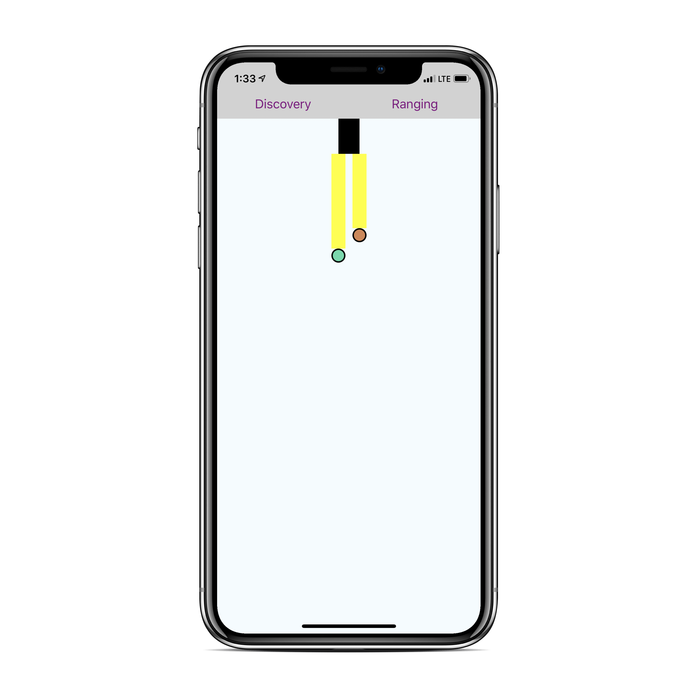

# react-native-redux-saga-event-channel-iBeacon-demo

Small react-native demo of [redux-saga](https://redux-saga.js.org/) [event channels](https://redux-saga.js.org/docs/advanced/Channels.html#using-the-eventchannel-factory-to-connect-to-external-events) in the setting of iBeacon discovery with Kontakt.io beacons using the [react-native-kontaktio](https://github.com/Driversnote-Dev/react-native-kontaktio) package.

<div align="center">
  
</div>

## What?

The black box is the phone and the dots are bluetooth beacons. The further away the beacon is (i.e. the weaker the signal strength), the larger the yellow line between the phone and the beacon becomes.

In the screen shot the beacon corresponding to the red dot is closer to the phone than the beacon corresponding to the green dot.

## Event channels

The main purpose of this project is to provide an usage example of event channels. In order to embed the listening for beacon signals in the redux flow of the rest of the app, we create an event channel in which we can later hook into with a redux-saga effect:

1. Write a function to set up an event channel.

	Whenever the event channel is closed, the returned unsubscribe function is called:

	```javascript
	export const setupBeaconDiscoveryChannel = () =>
	  eventChannel<Array<Beacon>>(emitter => {
	    let listener;
	
	    // Add beacon listener
	    listener =
	      kontaktEmitter &&
	      kontaktEmitter.addListener("didDiscoverDevices", ({ beacons }) => {
	        emitter(processBeacons(beacons));
	      });
	
	    // Unsubscribe function
	    return () => {
	      if (listener) listener.remove();
	    };
	  });
	```

2. Use the event channel

	The `take` effect of `redux-saga` is mostly used to listen for dispatched actions. We now use `take` to listen for emitted events from the `beaconChannel` we set up: 

	```javascript
	const beaconChannel = yield call(setupBeaconDiscoveryChannel);
	
	while (true) {
      const discoveredBeacons = yield take(beaconChannel);

      if (discoveredBeacons) {
        yield put(beaconDiscoverySuccess(discoveredBeacons));
      }
    }
	```

## How to run

### Note

* You need a real iOS device to properly communicate with beacons.
* These instructions assume a Mac computer with react-native development being setup.

### Steps to run

1. Prepare your Kontakt.io beacons

	Replace the `uniqueIds` value in the file `src/config.js` with the unique ids of your beacons. Add as many beacons as you want to the array.
	
	```javascript
	const config: Config = {
	  uniqueIds: ['tZVH', 'QDkt', 'ChAd'],
	};
	```
	
2. Install dependencies with `yarn`
3. Run the bundler with `yarn start` in a separate console window or tab.
4. Open xcode with `open ios/iBeaconDemo.xcodeproj/`
5. Connect an iPhone and press the run arrow on the top left. 

## Test

Run the unit tests with `yarn test`.

## Notes

* **iOS** only.
* So far only beacon discovery is implemented. Beacon ranging will follow.
* Better tests for the saga will follow.